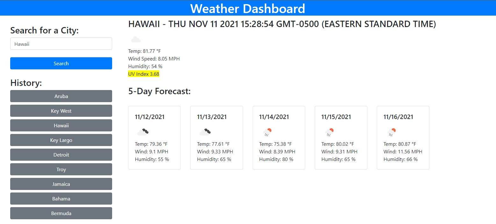

# Weather Challenge by Mark Kanczuzewski

The purpose of this exersize was to create a weather dashboard with form inputs. Upon entering a city the search button will cause current and future weather conditions to display. The current weather conditions will display city name, date, conditions icon, temperature, humidity, wind speed, and UV Index. The UV Index will change colors depending on its severity. Future weather conditions will list the next five days of weather including date, conditions icon, temperature, wind speed, and humidity. Search history of cities are listed below the search button as buttons themselves which will pull up the current and future conditions again. 

Installation: This website is deployed at the following location:
https://mkanczuzewski.github.io/Module-6-Challenge-MRK-110721/

Usage: This site is for educational purposesly only.

Credits: Mark Kanczuzewski

Copyright (c) [2021] [Mark Kanczuzewski]

Permission is hereby granted, free of charge, to any person obtaining a copy
of this software and associated documentation files (the "Software"), to deal
in the Software without restriction, including without limitation the rights
to use, copy, modify, merge, publish, distribute, sublicense, and/or sell
copies of the Software, and to permit persons to whom the Software is
furnished to do so, subject to the following conditions:

The above copyright notice and this permission notice shall be included in all
copies or substantial portions of the Software.

THE SOFTWARE IS PROVIDED "AS IS", WITHOUT WARRANTY OF ANY KIND, EXPRESS OR
IMPLIED, INCLUDING BUT NOT LIMITED TO THE WARRANTIES OF MERCHANTABILITY,
FITNESS FOR A PARTICULAR PURPOSE AND NONINFRINGEMENT. IN NO EVENT SHALL THE
AUTHORS OR COPYRIGHT HOLDERS BE LIABLE FOR ANY CLAIM, DAMAGES OR OTHER
LIABILITY, WHETHER IN AN ACTION OF CONTRACT, TORT OR OTHERWISE, ARISING FROM,
OUT OF OR IN CONNECTION WITH THE SOFTWARE OR THE USE OR OTHER DEALINGS IN THE
SOFTWARE.